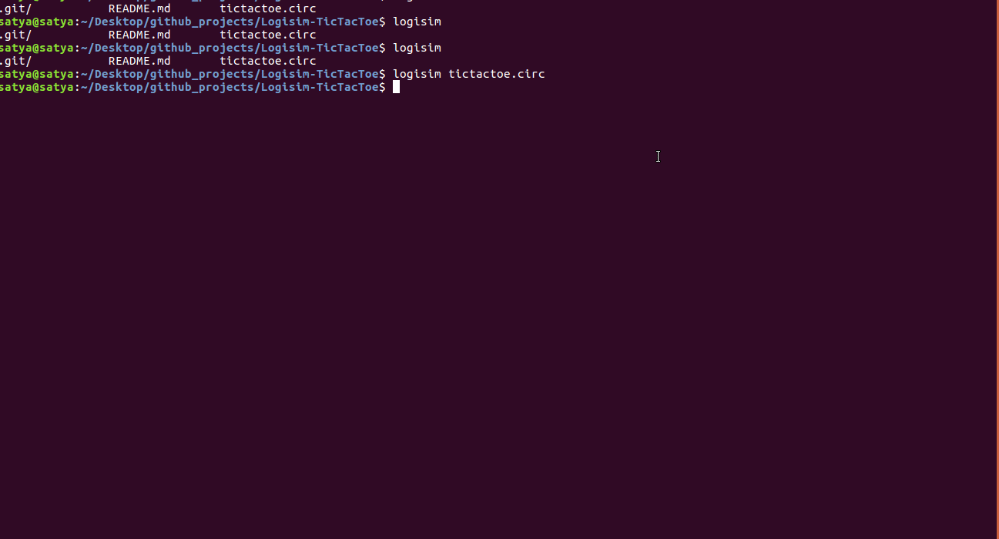

# Logisim-TicTacToe

Logisim is a tool for designing and simulating digital logic circuits.

Here is a demo video of Tic-Tac-Toe game using Logisim.

Installing logisim : sudo apt install logisim

Running the project : logisim tictactoe.circ